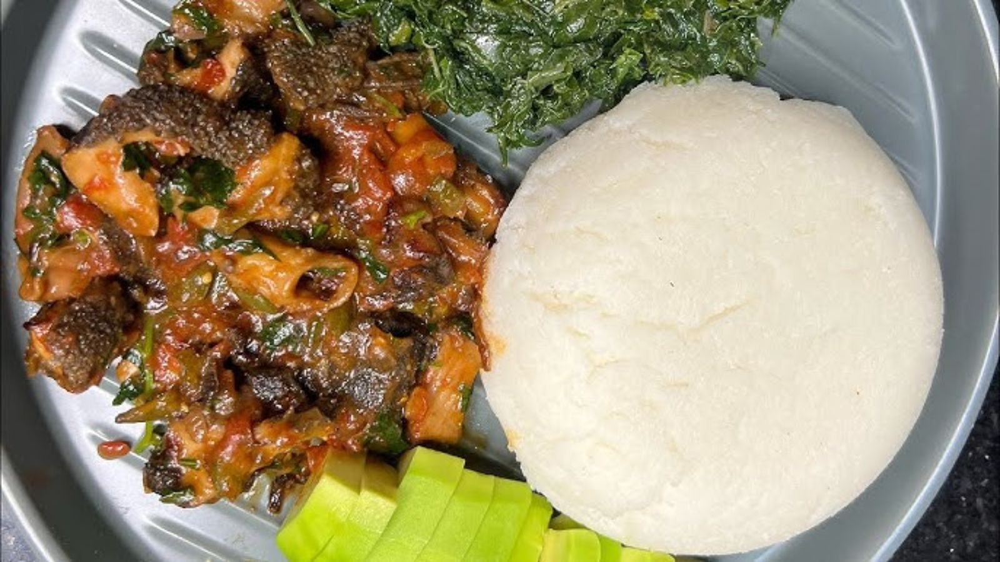
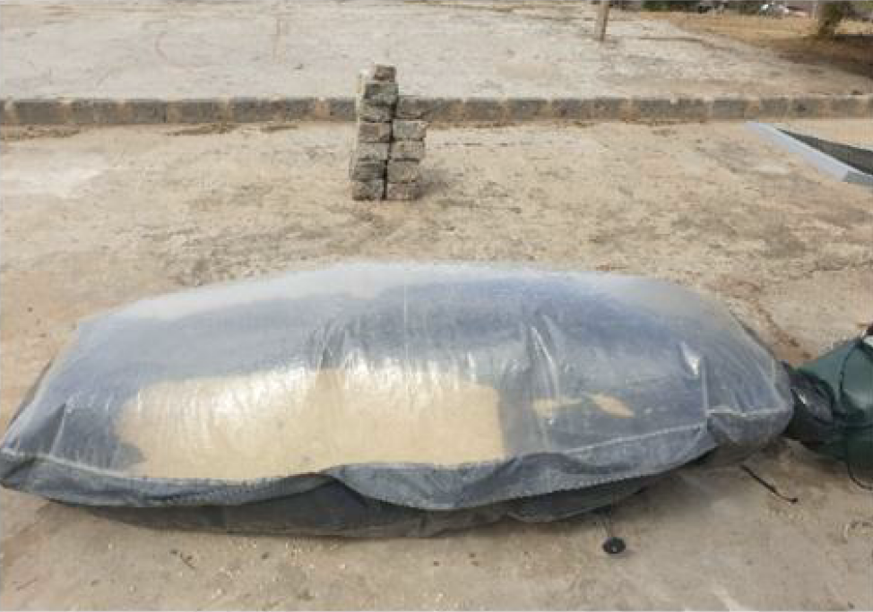
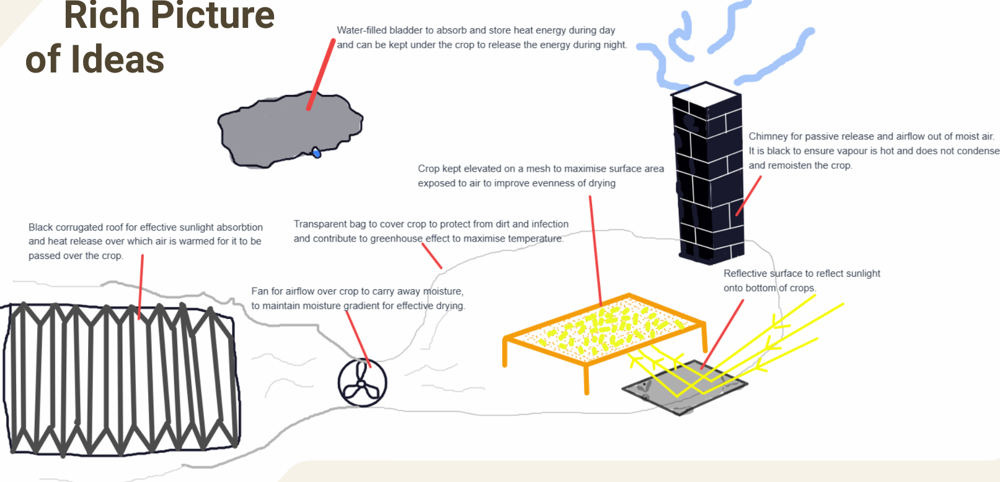
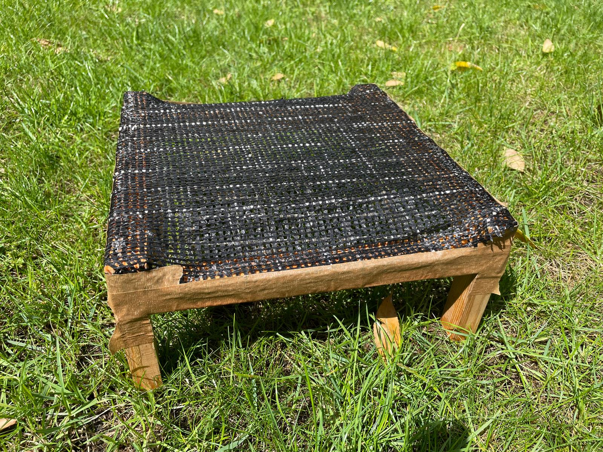
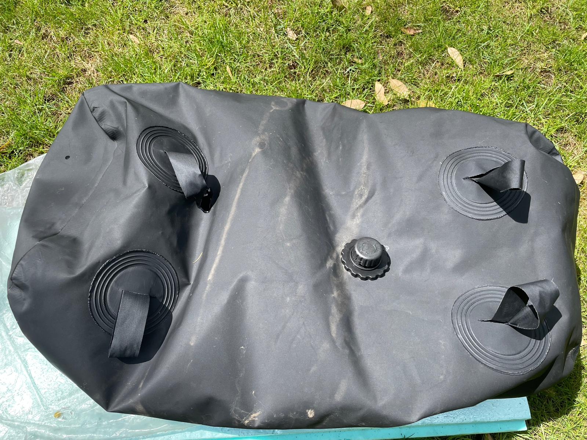
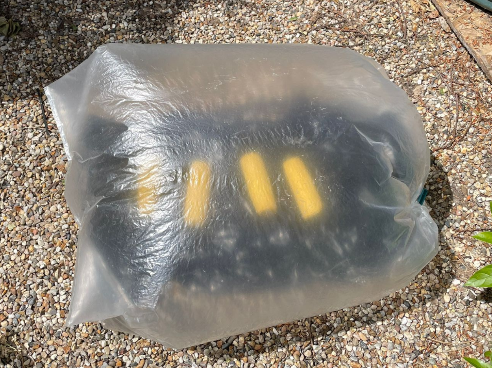
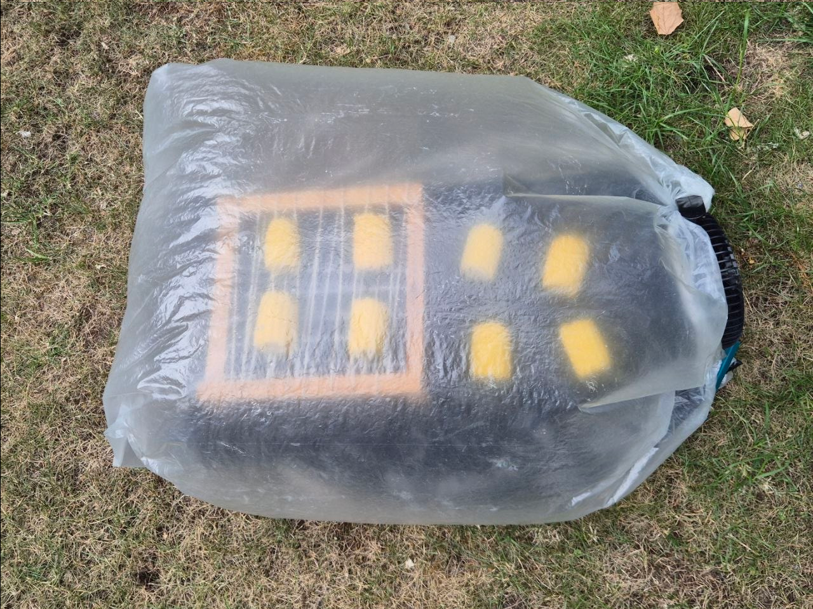
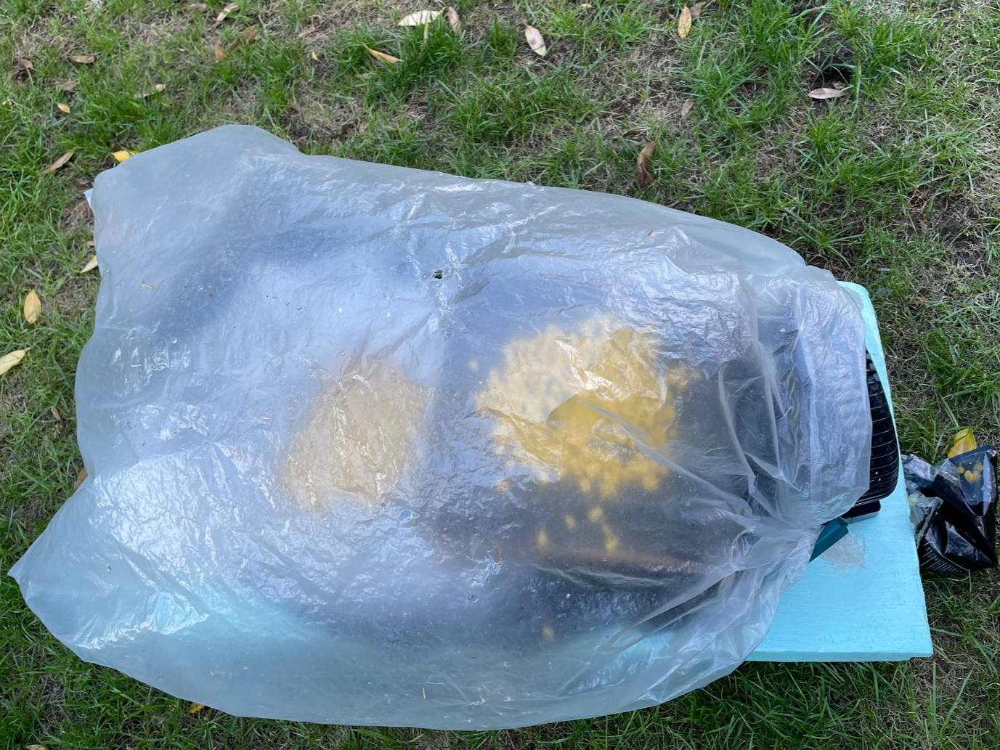
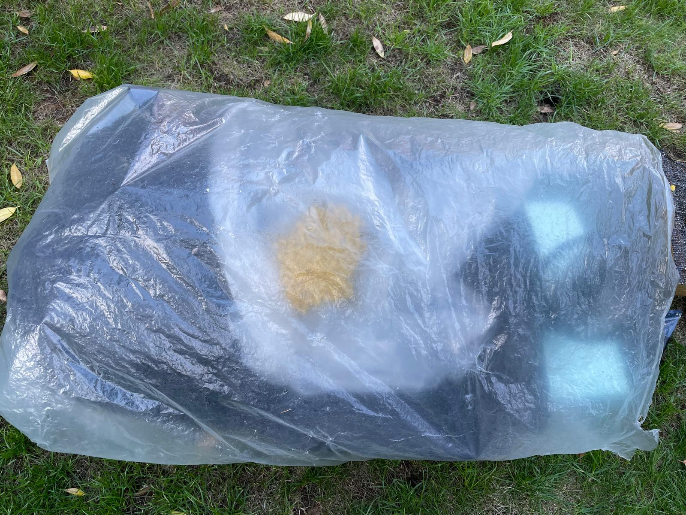

# Project SOLARSAFE 2026 - Mechanism

## General Context

From our talks with Benard and a professor Christine who specialises in Food Science at his university we understand the following: Aflatoxin is a toxic compound which is produced by Aspergillus molds which grow best in warm and humid conditions. A large problem in parts of Africa is that foods containing corn, tree nuts and peanuts can contain a lot of aflatoxin, and when these are consumed, the aflatoxin can reside in the liver and cause many deleterious health impacts, particularly increasing the risk of liver cancer. Cooking is not able to reduce the aflatoxin content. Ugali, as it is called in Kenya (Maize flour and water cooked till thick to form white solid as below) is a staple, simple-to-make cheap carbohydrate dish which fuels many, but unfortunately can contain high amounts of aflatoxin if made from infected maize and so this is a problem which affects many, particularly the smallholder farmers and common people. Aflatoxin infected foods are not visibly different nor in taste and so it is difficult for end-users to detect and avoid foods with high aflatoxin content.

Farmers currently try to prevent aflatoxin growth by drying the maize kernels by laying them out on the ground over a thin plastic, but sometimes the drying is not to a good enough degree, drying is uneven, and no good metric for dryness is used, leading to aspergillus growth not being prevented. 

Therefore, Benard’s solution was to build the SOLARSAFE solar dryer (pictured above), with the aim to dry maize more reliably and effectively. It improved upon the traditional drying methods by protecting maize from rain, insects, and dust, and dries with higher heat. However, there was scope to make drying more effective such as through optimising airflow or heating, and materials to be less conducive to aflatoxin growth, and so we came up with the following ideas in the following section.

## Technical Summary

We decided the feasible-to-test components with the most value added were to have airflow on both sides of the corn through a mesh to sit on, and to improve overnight heating with a bladder which absorbs energy throughout the day. We also thought it worthwhile to focus on making the prototype such that it is:

- Very inexpensive ([budget and materials](budget.md))
- Easy to build and set up   
- Easy to repair/function is not critical to any small amounts of damage or wear and tear  
- Feasible to scale up by increasing sizes  
- Environmentally responsible by not having to burn fuels  

We built the base prototype using bin bags obtained for free, a cardboard box shelter, a clip and a cheap battery powered fan. The mesh stand was made with scrap wood and string glued together, and then later a shade cloth attached with tape (picture below on the left). The water bladder was more expensive but could be used to dry a larger batch of corn than we did, and scales up well with regards to price (pictured below on the right). The prototype was constructed easily by hand and common tools such as glue and scissors and tape, with only the wood needing cutting by machine, but the structural parts could be made with many available scrap materials with reasonable dimensions and properties such as scrap wood, brick, metal or maybe even dried mud. 

  
  

We found that the base prototype (pictured below) worked successfully and dried 5.28% of the weight off the kernels.

Our results from our experiments with the string mesh (setup shown below) showed that the corn on the mesh yielded nearly 40% more drying than the corn on the plastic and visibly showed more even drying due to all sides being exposed.   

We also conducted experiments with a shade cloth on the stand (picture below on the top left and right) so that kernels could be dried on it, as well as one with a water bladder (picture below on the bottom), with controls for both, but both experiments were inconclusive due to rainy conditions affecting the integrity of the experiments.

  
  
  

## Reflective discussion
The United Nations [Sustainable Development Goals](https://sdgs.un.org/goals) (SDG) are a set of 17 overarching goals that call upon all countries to work towards current and future peace and prosperity for people and the planet. We have identified the following goals:
- 2 Zero Hunger  
- 3 Good Health and Wellbeing  
- 7 Affordable and Clean Energy  
- 9 Industry, Innovation, and Infrastructure  
- 12 Responsible Consumption and Production  
- 13 Climate Action  
- 17 Partnerships for the Goals

The following table lists the targets associated with each goal and their relevance to this project. 

| SDG target | Application to Project | Link strength |
| :---- | :---- | :---- |
| SDG 2.1: End hunger and ensure access to safe, nutritious and sufficient food | Drying maize safely reduces spoilage and aflatoxin risk, helping preserve food after harvest. This supports safer and more reliable food availability. | Strong |
| SDG 2.3: Increase productivity and incomes of smallholder food producers | A low-cost dryer can help smallholder farmers reduce post-harvest losses and preserve more suitable-to-sell grain, improving productivity and income potential. | Strong |
| SDG 2.4: Sustainable and resilient agricultural practices | The dryer improves resilience against humid weather and inconsistent air drying. It supports more reliable post-harvest handling under changing weather conditions. | Strong |
| SDG 3.9: Reduce illness from pollution, contamination, and hazardous chemicals | Better maize drying can reduce mould growth and potential aflatoxin contamination, supporting safer food consumption. Although it is not a healthcare project, this project has food-safety implications. | Low |
| SDG 7.2: Increase the share of renewable energy | The dryer uses solar energy as the main heat source. A hybrid backup can improve reliability while still reducing dependence on conventional fuel-based drying. | Strong |
| SDG 7.3: Improve energy efficiency | The design can improve drying efficiency through solar heat capture, insulation, thermal storage, reflectors, controlled airflow, and reduced heat loss. | Strong |
| SDG 9.4: Upgrade infrastructure and adopt clean technologies | The project develops a small-scale clean drying technology for post-harvest handling, using more resource-efficient and environmentally-conscious designs. | Strong |
| SDG 12.3: Reduce food losses along production and supply chains | The dryer directly targets post-harvest maize loss by helping grain reach safer moisture levels before storage. | Very Strong |
| SDG 12.5: Reduce waste generation | By reducing spoiled maize and designing a reusable dryer, the project can reduce food and material waste.  | Very Strong |
| SDG 13.2: Integrate climate action into planning | The dryer reduces dependence on favourable weather for drying and supports adaptation to humid or unpredictable drying conditions. Using solar heat to replace fuel-intensive drying can also reduce emissions. | Medium |
| SDG 17.16: Enhance multi-stakeholder partnerships | The project involves working with an on-the-ground organisation in Kenya. This helps ensure the design is informed by local needs, constraints, and user feedback. | Strong |
| SDG 17.17: Encourage effective partnerships | The local partnership supports practical implementation by connecting the technical team with local knowledge, materials, deployment conditions, and potential users. | Strong |

## Project Management and Teamwork Strategy

Our project management strategy was based on dividing the overall hybrid solar dryer project into three main sub-teams: Mechanism, Materials, and Electric Heating. This division allowed the group to separate the main technical challenges of the project and work on them in parallel. 

Being the Mechanism team, the project scope was the physical structure, movement of air through the dryer, heat capture, thermal energy storage, construction materials, cost to drying efficacy ratio, ease of construction and reparability, robustness, scalability, and environmental impact. 

The Materials team worked on aflatoxin permeability through, and binding affinity to the plastic material used for the bag, while the Electric Heating team worked on electric air heating methods for use when sunlight is limited. 

This structure worked well because it created a clearer separation of concerns. Instead of every member trying to solve the entire project at once, each sub-team could focus on a smaller and more manageable part of the design. This made the ideation process faster, since different parts of the system could be developed at the same time. It also allowed each sub-team to explore more specific design options, such as water bladders for thermal storage. As a result, the sub-teams were able to generate and compare ideas more efficiently than if all design decisions had been handled as one large task.

However, the separation into sub-teams also created some challenges. Since the dryer works as one integrated system, decisions made by one team can possibly affect the others. For example, the Electric Heating team initially looked into thermal energy storage systems together with us. We were not aware of this and both presented very similar proposals. Similarly, findings from the Materials team on which plastic was best suited to keep aflatoxin concentration low would affect the Mechanism, since different plastics can have different physical properties, like flexibility and transparency. This meant that the teams could not work completely independently. Regular communication was needed to reduce duplicated work and to prevent incompatible design choices. To manage this, we maintained mutual communication between teams by sharing progress, assumptions, resources, and design changes. 

Within our own sub-team, both members were involved in all aspects of the work rather than assigning completely separate individual roles. This was useful because it meant that both of us understood the full mechanism design and could contribute to design decisions, risk assessment, and documentation. It also made the work more resilient, since either member could continue progress if the other was unavailable. The drawback was that it sometimes made workload boundaries less clear. In future, it would be better to keep shared responsibility for major decisions while assigning clearer ownership for specific tasks, such as prototype construction, testing, documentation, or research.

Overall, the teamwork strategy was effective because it balanced parallel development with group communication. The main recommendation for improvement is to introduce more formal coordination points, such as short scheduled updates, and clearer task ownership within sub-teams. This would preserve the benefits of sub-team independence while reducing confusion when design choices overlap. 
