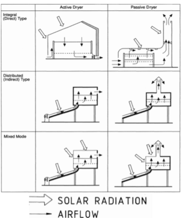
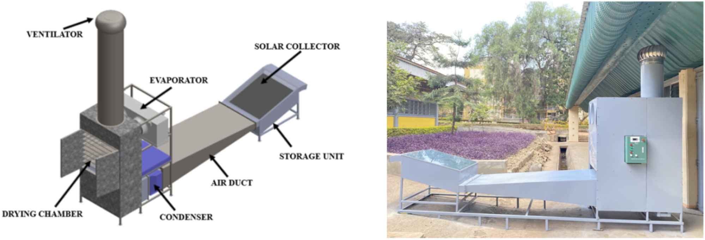
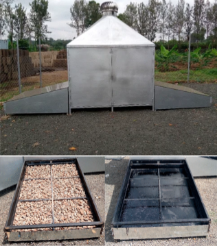
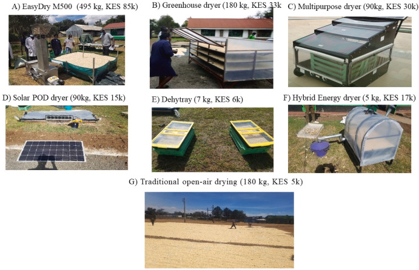
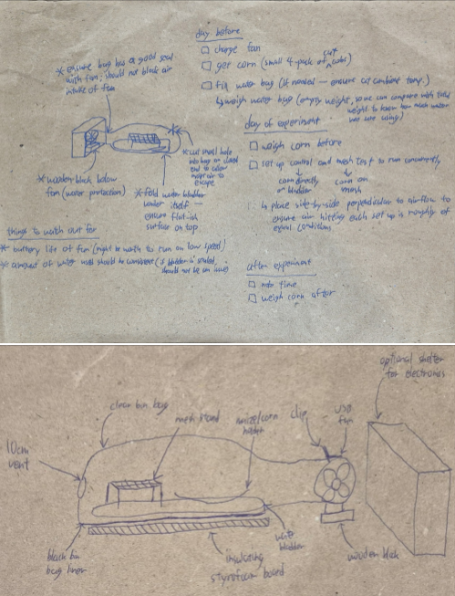

## Important Note

All work described here was jointly undertaken by both Aditya and Donovan and thus cannot be split cleanly into individual contributions. We have sought permission from Tom Bashford (our project coordinator) via email and we agree to receive very similar marks for this component of the final submission. We have also indicated the author with the majority contribution for each section in this report, according to the instructions posted to Moodle. 

## Technology Landscape (Donovan)

This research phase was used to understand existing maize drying approaches in the technology landscape and to identify a design direction that would be suitable for a low-cost, locally deployable solar dryer. 

### Solar Drying

Solar dryers can be broadly classified as **direct** or **indirect**, and as **active** or **passive** systems. In a **direct** solar dryer, the crop is exposed directly to solar radiation inside a covered drying chamber. This can be simple and low-cost, but direct exposure may affect product quality, including colour change, nutrient degradation, and surface cracking. In contrast, an **indirect** solar dryer heats air in a separate solar collector before passing the warm air through the maize. This reduces direct radiation exposure on the crop and gives better control over drying conditions.

Solar dryers can also be **passive** or **active**. **Passive** systems rely on natural convection, usually assisted by a chimney effect, while **active** systems use a fan to force airflow through the dryer. **Passive** designs are cheaper and require no electrical input, but airflow is less controllable. **Active** systems can improve consistency by maintaining airflow through the maize bed, but require a power source.

<figure align="center">
  
  <figcaption>
    Types of solar dryers (<a href="https://www.sciencedirect.com/science/article/pii/S0196890496001021">Ekechukwu &amp; Norton, 1997</a>).
  </figcaption>
</figure>

For this project, we considered all types, as well as hybrid systems that use a mix of everything. 

### Thermal Energy Storage (TES)

Thermal energy storage was investigated because solar drying weakens during cloudy periods, evening, or night. Storage materials can absorb heat during periods of strong sunlight and release it later to maintain warmer drying air. The research considered 3 main categories of TES:

- **Sensible** heat storage: energy is stored by raising the temperature of a material without changing its phase. Common examples include water, sand, and rocks.  
- **Latent** heat storage: energy is stored during a phase change, typically using phase-change materials such as paraffin wax. These materials can store and release large amounts of energy at relatively constant temperatures.  
- **Thermo-chemical** heat storage: energy is stored through reversible chemical reactions or sorption processes. These systems can achieve high energy storage densities but are generally more complex and expensive than sensible or latent heat storage methods. 

<figure align="center">
  
  <figcaption>
    Solar-assisted heat pump dryer integrated with TES (<a href="https://scijournals.onlinelibrary.wiley.com/doi/full/10.1002/jsf2.70021">Kalage et al., 2026</a>).
  </figcaption>
</figure>

<figure align="center">
  
  <figcaption>
    Passive TES dryer using soapstone (<a href="https://pubs.acs.org/doi/10.1021/acsomega.3c07314">Rulazi et al., 2023</a>).
  </figcaption>
</figure>

For this project, sensible heat storage using water was selected as the most practical option because it is inexpensive, widely available, safe to handle, and has a high specific heat capacity. A water bladder can act as a low-cost thermal store, absorbing heat during the day and releasing it later as the air temperature falls. Although water does not provide as stable a temperature as latent heat storage materials, it is much easier to obtain and is better suited to a low-cost prototype.

### Burning Fuels as a Heat Source

Fuel-based dryers were also explored as part of the technology landscape. Some existing maize dryers use biofuel or biomass (e.g. maize cobs) combustion to heat air. These systems can operate at night and during poor weather, making them more reliable than solar-only dryers. However, they introduce additional cost, safety risks, greenhouse gas emissions, and operational complexity. They also require a continuous fuel supply and careful design to avoid smoke contamination of the maize.

<figure align="center">
  
  <figcaption>
    Panel A (EasyDry M500 developed by ACDI/VOCA) and Panel F (Hybrid Energy dryer developed by KALRO) burn biofuel to heat air (<a href="https://www.sciencedirect.com/science/article/pii/S0022474X2300084X">De Groote et al., 2023</a>).
  </figcaption>
</figure>

For this project, fuel combustion was not considered because the aim was to keep the system simple, safe for testing, low-cost, and primarily emission-free. 

## Exploring the Solution Design Space (Donovan)

Following the initial research, a range of possible drying concepts and supporting technologies were explored through brainstorming and by examining the solutions above. Rather than selecting a concept solely on technical performance, ideas were filtered against a set of criteria relevant to the project context:

- Practicality and ease of construction  
- Scale vs. cost (reasonable cost per amount of maize dried)  
- Drying effectiveness  
- Availability of materials and resources  
- Social acceptability and ease of adoption  
- Farmer effort required for operation and maintenance  
- Environmental responsibility

This process generated several promising concepts, including different airflow arrangements, TES approaches, passive and active ventilation methods, and alternative drying chamber configurations. A rich picture was then used to capture these ideas.

<figure align="center">
  
  <figcaption>
    Rich picture (Aditya).
  </figcaption>
</figure>

## Implications for the Final Design (Donovan)

Unforeseen delays in formal risk assessment and material procurement procedures, as well as bad weather led us to narrow the scope, and we only focused on a subset of the ideas. 

Final design choices:

- Water-based TES was selected because water is inexpensive, widely available, safe to handle, and capable of storing useful amounts of thermal energy.  
- A mesh drying stand was adopted because it is simple, familiar, and promotes airflow around the maize.  
- An active ventilation system with a USB fan was chosen so that airflow could be provided conveniently, while potentially allowing space for a passive chimney in future iterations.  
- Combustion heating was excluded due to safety concerns, greenhouse gas emissions, additional operating costs, and increased complexity.  
- Low-cost, commonly available materials were prioritised to maximise replicability and scalability.  
- Simple monitoring methods, such as weight loss measurements and drying rate calculations were preferred over expensive instrumentation.

This option was judged to be the most feasible to build and test within the project's constraints, including limited materials, available expertise, and testing time. The unique selling point of the prototype is its simplicity. It is designed to be easy to build and inexpensive at larger scale while still addressing key requirements such as reducing post-harvest losses while maintaining environmental responsibility. 

## Setup and Considerations (Aditya)

<figure align="center">
  
  <figcaption>
    Experimental diagram and checklist (Donovan).
  </figcaption>
</figure>

Considerations for the setup included:

- Using a clip (or other fastening method) to attach the bag to the fan and form a seal whilst being able to open the undo it to access the contents within the bag without damaging it.  
- Ensure bag is fastened only around the rim of the fan and doesn’t block parts of the front or back of the fan  
- Ensure black bin back is stuck to the bottom and doesn’t obstruct airflow or curl around the corn as the bag gets inflated  
- Cutting a hole of about 10cm to ensure sufficient airflow but also sufficient internal pressure for bag to inflate and not rest on corn  
- Ensure water bladder is of appropriate dimension (we learned the hard way that its lack of structure means that reducing size by underfilling and folding of the heavy bag was quite difficult, and did not provide an even surface for the corn to rest evenly on. We would recommend getting the dimensions which weren’t too big and filling it till turgid, or the container stiff rather than flexible)  
- Sufficient protection of electronics from rain if intending to experiment in rain  
- Positioning of equipment such that is it always exposed to sunlight as the sun’s position changes  
- Charging the bladder well in the Sun the day before a night experiment  
- Ensure enough charge left in fan

The experimental setups for for the 4 investigations are shown below: 

<table>
  <tr>
    <td align="center" width="50%">
      
       
      
        Validation of base setup.
      
    </td>
    <td align="center" width="50%">
      
       
      
        String mesh and control test.
      
    </td>
  </tr>
  <tr>
    <td align="center" width="50%">
      
       
      
        Shade cloth mesh and control test.
      
    </td>
    <td align="center" width="50%">
      
       
      
        Bladder test.
      
    </td>
  </tr>
</table>

Key experimental procedures to control:

- Moving the equipment with the sunlight as the Sun changes position  
- Same placement on ground and orientation (i.e we kept the fan furthest for the direction the Sun was coming from to ensure it did not cast a shadow on the corn, and had similar movement and orientation schedules to keep the equipment in the sunlight)  
- Ensure control and test experiments have roughly even spread of kernels, and have same weight  
- If control and test can be done in the same bag at the same time, do so to keep more factors the same

## Experiment Results (Aditya)

<table class="tg"><thead>
  <tr>
    <th class="tg-y6fn">#</th>
    <th class="tg-y6fn">Description</th>
    <th class="tg-y6fn">Date</th>
    <th class="tg-y6fn">Start</th>
    <th class="tg-y6fn">End</th>
    <th class="tg-y6fn">Dur</th>
    <th class="tg-y6fn">cob #</th>
    <th class="tg-y6fn">Starting Weight / g</th>
    <th class="tg-y6fn">Ending Weight / g</th>
    <th class="tg-y6fn">Weight Lost / %</th>
    <th class="tg-y6fn">Drying Rate / g⋅h^-1</th>
    <th class="tg-y6fn">Percentage Weight Loss Rate / %⋅h^-1</th>
    <th class="tg-y6fn">Weather Conditions</th>
    <th class="tg-y6fn">Remarks</th>
  </tr></thead>
<tbody>
  <tr>
    <td class="tg-0lax">1</td>
    <td class="tg-0lax">Trial</td>
    <td class="tg-0lax">30/05</td>
    <td class="tg-0lax">1300</td>
    <td class="tg-0lax">1900</td>
    <td class="tg-0lax">06:00</td>
    <td class="tg-0lax">total</td>
    <td class="tg-0lax">796</td>
    <td class="tg-0lax">754</td>
    <td class="tg-0lax">5.28%</td>
    <td class="tg-0lax">7.00</td>
    <td class="tg-0lax">0.88%</td>
    <td class="tg-0lax"><a href="https://open-meteo.com/en/docs?hourly=temperature_2m,relative_humidity_2m,cloud_cover&bounding_box=-90,-180,90,180&latitude=52.2&longitude=0.12&timezone=Europe%2FLondon&time_mode=time_interval&start_date=2026-05-30&end_date=2026-05-30">open-meteo</a></td>
    <td class="tg-0lax">total of 4 cobs; on black surface</td>
  </tr>
  <tr>
    <td class="tg-0lax" rowspan="10">2</td>
    <td class="tg-0lax" rowspan="10">Old mesh</td>
    <td class="tg-0lax" rowspan="10">31/05</td>
    <td class="tg-0lax" rowspan="10">1100</td>
    <td class="tg-0lax" rowspan="10">1730</td>
    <td class="tg-0lax" rowspan="10">06:30</td>
    <td class="tg-0lax">mesh 1</td>
    <td class="tg-0lax">116</td>
    <td class="tg-0lax">104</td>
    <td class="tg-0lax">10.34%</td>
    <td class="tg-0lax">1.846153846</td>
    <td class="tg-0lax">1.59%</td>
    <td class="tg-0lax" rowspan="10"><a href="https://open-meteo.com/en/docs?hourly=temperature_2m,relative_humidity_2m,cloud_cover&bounding_box=-90,-180,90,180&latitude=52.2&longitude=0.12&timezone=Europe%2FLondon&forecast_days=1&time_mode=time_interval&start_date=2026-05-31&end_date=2026-05-31">open-meteo</a></td>
    <td class="tg-0lax" rowspan="10">cobettes; 4 on mesh, 4 on black surface (control)</td>
  </tr>
  <tr>
    <td class="tg-0lax">mesh 2</td>
    <td class="tg-0lax">80</td>
    <td class="tg-0lax">72</td>
    <td class="tg-0lax">10.00%</td>
    <td class="tg-0lax">1.230769231</td>
    <td class="tg-0lax">1.54%</td>
  </tr>
  <tr>
    <td class="tg-0lax">mesh 3</td>
    <td class="tg-0lax">92</td>
    <td class="tg-0lax">84</td>
    <td class="tg-0lax">8.70%</td>
    <td class="tg-0lax">1.230769231</td>
    <td class="tg-0lax">1.34%</td>
  </tr>
  <tr>
    <td class="tg-0lax">mesh 4</td>
    <td class="tg-0lax">102</td>
    <td class="tg-0lax">96</td>
    <td class="tg-0lax">5.88%</td>
    <td class="tg-0lax">0.9230769231</td>
    <td class="tg-0lax">0.90%</td>
  </tr>
  <tr>
    <td class="tg-0lax" colspan="3">mesh avg.</td>
    <td class="tg-0lax">8.73%</td>
    <td class="tg-0lax">1.307692308</td>
    <td class="tg-0lax">1.34%</td>
  </tr>
  <tr>
    <td class="tg-0lax">control 1</td>
    <td class="tg-0lax">114</td>
    <td class="tg-0lax">108</td>
    <td class="tg-0lax">5.26%</td>
    <td class="tg-0lax">0.9230769231</td>
    <td class="tg-0lax">0.81%</td>
  </tr>
  <tr>
    <td class="tg-0lax">control 2</td>
    <td class="tg-0lax">114</td>
    <td class="tg-0lax">106</td>
    <td class="tg-0lax">7.02%</td>
    <td class="tg-0lax">1.230769231</td>
    <td class="tg-0lax">1.08%</td>
  </tr>
  <tr>
    <td class="tg-0lax">control 3</td>
    <td class="tg-0lax">98</td>
    <td class="tg-0lax">92</td>
    <td class="tg-0lax">6.12%</td>
    <td class="tg-0lax">0.9230769231</td>
    <td class="tg-0lax">0.94%</td>
  </tr>
  <tr>
    <td class="tg-0lax">control 4</td>
    <td class="tg-0lax">118</td>
    <td class="tg-0lax">110</td>
    <td class="tg-0lax">6.78%</td>
    <td class="tg-0lax">1.230769231</td>
    <td class="tg-0lax">1.04%</td>
  </tr>
  <tr>
    <td class="tg-0lax" colspan="3">control avg.</td>
    <td class="tg-0lax">6.30%</td>
    <td class="tg-0lax">1.076923077</td>
    <td class="tg-0lax">0.97%</td>
  </tr>
  <tr>
    <td class="tg-0lax" rowspan="3">4</td>
    <td class="tg-0lax" rowspan="3">Bladder</td>
    <td class="tg-0lax">02/06</td>
    <td class="tg-0lax">2300</td>
    <td class="tg-0lax">1000</td>
    <td class="tg-0lax">11:00</td>
    <td class="tg-0lax">total</td>
    <td class="tg-0lax">520</td>
    <td class="tg-0lax">494</td>
    <td class="tg-0lax">5.00%</td>
    <td class="tg-0lax">2.363636364</td>
    <td class="tg-0lax">0.45%</td>
    <td class="tg-0lax"><a href="https://open-meteo.com/en/docs?hourly=temperature_2m,relative_humidity_2m,cloud_cover&bounding_box=-90,-180,90,180&latitude=52.2&longitude=0.12&timezone=Europe%2FLondon&forecast_days=1&time_mode=time_interval&start_date=2026-06-02&end_date=2026-06-03">open-meteo</a></td>
    <td class="tg-0lax">kernels; without bladder</td>
  </tr>
  <tr>
    <td class="tg-0lax">04/06</td>
    <td class="tg-0lax">2330</td>
    <td class="tg-0lax">1000</td>
    <td class="tg-0lax">10:30</td>
    <td class="tg-0lax">total</td>
    <td class="tg-0lax">520</td>
    <td class="tg-0lax">515.1</td>
    <td class="tg-0lax">0.94%</td>
    <td class="tg-0lax">0.4666666667</td>
    <td class="tg-0lax">0.09%</td>
    <td class="tg-0lax"><a href="https://open-meteo.com/en/docs?hourly=temperature_2m,relative_humidity_2m,cloud_cover&bounding_box=-90,-180,90,180&latitude=52.2&longitude=0.12&timezone=Europe%2FLondon&forecast_days=1&time_mode=time_interval&start_date=2026-06-04&end_date=2026-06-05">open-meteo</a></td>
    <td class="tg-0lax">kernels; without bladder</td>
  </tr>
  <tr>
    <td class="tg-0lax">05/06</td>
    <td class="tg-0lax">2300</td>
    <td class="tg-0lax">1130</td>
    <td class="tg-0lax">12:30</td>
    <td class="tg-0lax">total</td>
    <td class="tg-0lax">531</td>
    <td class="tg-0lax">663</td>
    <td class="tg-0lax">-24.86%</td>
    <td class="tg-0lax">-10.56</td>
    <td class="tg-0lax">-1.99%</td>
    <td class="tg-0lax"><a href="https://open-meteo.com/en/docs?hourly=temperature_2m,relative_humidity_2m,cloud_cover&bounding_box=-90,-180,90,180&latitude=52.2&longitude=0.12&timezone=Europe%2FLondon&forecast_days=1&time_mode=time_interval&start_date=2026-06-05&end_date=2026-06-06">open-meteo</a></td>
    <td class="tg-0lax">kernels; with bladder in bag </td>
  </tr>
  <tr>
    <td class="tg-0lax" rowspan="2">3</td>
    <td class="tg-0lax" rowspan="2">New mesh</td>
    <td class="tg-0lax" rowspan="2">08/06</td>
    <td class="tg-0lax" rowspan="2">1900</td>
    <td class="tg-0lax" rowspan="2">2300</td>
    <td class="tg-0lax" rowspan="2">04:00</td>
    <td class="tg-0lax">mesh</td>
    <td class="tg-0lax">300</td>
    <td class="tg-0lax">297.5</td>
    <td class="tg-0lax">0.83%</td>
    <td class="tg-0lax">0.625</td>
    <td class="tg-0lax">0.21%</td>
    <td class="tg-0lax" rowspan="2"><a href="https://open-meteo.com/en/docs?hourly=temperature_2m,relative_humidity_2m,cloud_cover&bounding_box=-90,-180,90,180&latitude=52.2&longitude=0.12&timezone=Europe%2FLondon&forecast_days=1&time_mode=time_interval&start_date=2026-06-08&end_date=2026-06-08">open-meteo</a></td>
    <td class="tg-0lax" rowspan="2">kernels; 300g each on mesh and control</td>
  </tr>
  <tr>
    <td class="tg-0lax">control</td>
    <td class="tg-0lax">300</td>
    <td class="tg-0lax">305.8</td>
    <td class="tg-0lax">-1.93%</td>
    <td class="tg-0lax">-1.45</td>
    <td class="tg-0lax">-0.48%</td>
  </tr>
</tbody></table>

  <caption>
    <a href="https://github.com/Technology-for-the-Poorest-Billion/2026-SOLARSAFE-Mechanism/blob/main/final/Drying%20Experiment%20Data.xlsx">Experiment data</a> in folder "final" (Donovan).
  </caption>

The metrics for drying effectiveness we have included are:

- $\text{Weight \% loss}=\frac{W_{\text{start}}-W_{\text{end}}}{W_{\text{start}}}\times100\%$. 
Normalises loss of weight with starting weight of test samples.  
- $\text{Drying rate}=\frac{W_{\text{start}}-W_{\text{end}}}{duration}$. 
This is the important metric in working out drying capacity of a dryer when at full capacity, as it gives the total scale of the drying. Note that it scales up with how much corn you fill the dryer with and so skews for experiments with larger test batches and so is less important for the experiments but important to validate drying capacity when working at intended capacity.  
- $\text{Weight \% loss rate}=\frac{W_{\text{start}}-W_{\text{end}}}{W_{\text{start}}\times duration}\times100\%$. 
This normalises the drying rate for weight of sample put in, and so is the most useful metric to evaluate different experiment drying effectiveness given differing start weights of corn.

A summary of the data:

- The base setup was valid and reduced the weight of the corn cobs by 5.28%, in very hot and sunny weather.   
- We found that the cobettes (half corn cobs) dried nearly 40% more on a string mesh stand in reasonably sunny weather, and also visibly dried more evenly.  
- Despite the worse weather, even the control cobettes on the floor had a higher weight percentage loss rate by 10% than the whole cobs, and so the extra surface area to volume ratio is likely a significant factor in drying efficacy. Although we did not expect the solid inner cob to lose significant weight, perhaps it did contribute to the drying weight loss as had the main increase in surface area exposed when switching from 1 cob to 2 cobettes.     
- The drying cloth mesh showed that the corn on the mesh dried by 0.7 wt%, but the kernels gained 1.45 wt% but conditions were wet and so the experiment may lack some validity in whether the change in weight had pure correspondence to dying efficacy of the setup.  
- The first overnight control experiment had a 5 wt% loss, whereas the second one was compromised with light rain,and had 0.4 wt% loss. The overnight experiment with the bladder was particularly compromised with heavy rain, kernels gathered into a sag in the bladder (which we underfilled to fit in the bag), and fan disconnecting from the bag.

## Conclusion (Aditya)

In conclusion, we found the string mesh to provide a significant increase in drying rate, and with similar principles, the shade cloth mesh is likely to be even more effective as it allows kernels (higher surface area to volume ratio) rather than cobs to sit on it. A significant limitation of this investigation was the variability of English weather conditions between experiments, particularly rainfall during the last 3\-4 trials, which reduced the repeatability and comparability of results. Therefore we were not able to convincingly experimentally validate whether the shade cloth mesh or the water bladder are effective tools for drying. The bladder investigations will likely have to be done in Kenya, where there is the benefit of lots of sunlight and high daytime temperature to boost the effectiveness of energy storage for nighttime. If providing effective drying, we believe that the bladder is a cheaply scalable and direct way of capturing and using solar energy and may allow for the drying system to be completely passive even during the night if paired with a passive ventilation mechanism such as a darkened chimney to create a pressure differential as heated air rises. This would mean that solar panels and batteries would not be required or provide energy elsewhere, reducing costs and environmental impact. If the shade cloth mesh also performs well in accordance with our string mesh results, it can be easily built and improve drying efficacy and evenness when implemented. It is compatible with Benard’s design, and scaled up versions of it, and so is likely a viable solution.
